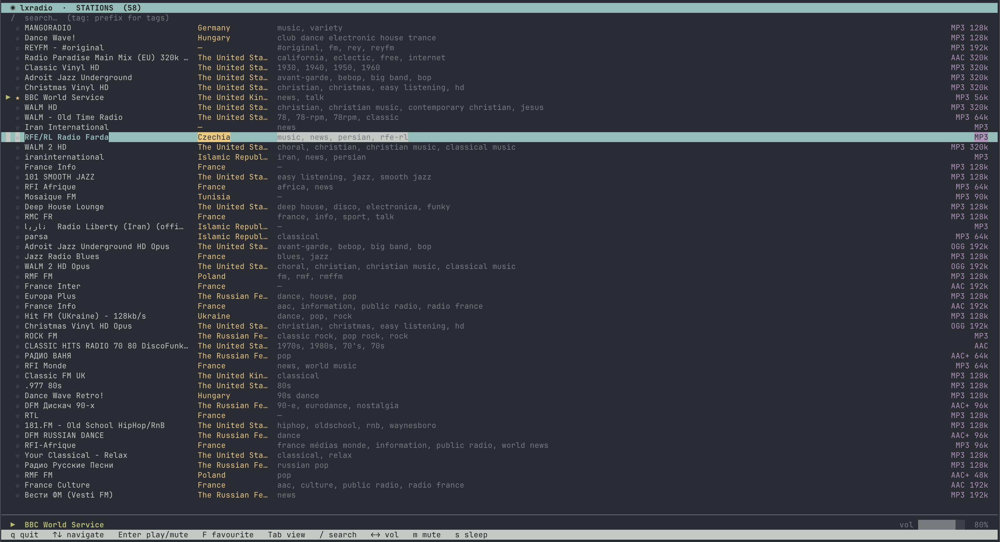

# lxradio

A minimal, fast terminal radio player. Browse and search thousands of internet radio stations from [radio-browser.info](https://www.radio-browser.info/), manage favourites, and play streams via `mpv`.



## Requirements

- Python ≥ 3.10
- [mpv](https://mpv.io/) (must be available in `PATH`)

## Installation

`lxradio` is not yet on PyPI. Install from source:

```bash
git clone https://github.com/SwordfishTrumpet/lxradio
cd lxradio
python3 -m venv .venv
source .venv/bin/activate
pip install -e .
```

## Usage

```bash
lxradio
```

Or run directly without installing:

```bash
python run.py
```

## Keybindings

| Key | Action |
|-----|--------|
| `↑` / `↓` or `j` / `k` | Navigate station list |
| `Enter` | Play selected / mute current station |
| `Space` | Play/pause toggle |
| `f` | Toggle favourite |
| `m` | Mute / unmute |
| `Tab` | Cycle through browse / favourites / history view |
| `/` | Search by name (prefix with `tag:` for tag search) |
| `+` / `=` | Volume up |
| `-` | Volume down |
| `s` | Set sleep timer (15m → 30m → 60m → Off) |
| `S` | Cancel sleep timer |
| `q` | Quit |

## Search

- Type a name to search stations by name.
- Prefix with `tag:` to search by a single tag, e.g. `tag:jazz`.
- Use commas for multi-tag search, e.g. `tag:rock,classic`.

## Features

- **Thread-safe station loading** with fallback API hosts and DNS caching for fast browsing.
- **Parallel search** — free-text search queries the `name`, `tag`, and `country` endpoints concurrently via `ThreadPoolExecutor(max_workers=2)`, cutting worst-case latency from ~24s to ~16s.
- **Paginated search** — free-text and tag searches load additional results as you scroll.
- **Atomic favourites** writes with automatic backup on corruption.
- **Listening history** — every station played and its song metadata is logged to `~/.config/lxradio/history.jsonl` ( capped at 1000 entries) with a dedicated History view accessible via `Tab`.
- **App-scoped volume** via mpv on macOS; on Linux it falls back to `pactl` when the IPC socket is unavailable.
- **Graceful shutdown** on `SIGINT` / `SIGTERM` — mpv child processes are cleaned up.
- **Heartbeat detection** — stale streams are detected automatically.
- **Click deduplication** — rapid Enter presses on the same station are debounced to avoid duplicate API click-tracking requests.
- **Full tag data** — all station tags are retained internally; only display is truncated, enabling future tag filtering or cloud features.
- **Registration-driven keybindings** — adding a new shortcut is a single line of registration; footer help text is generated automatically.

## Known limitations

- **Linux volume**: On Linux, mpv IPC is attempted first for volume control; if the IPC socket is unavailable, `pactl` is used as a fallback. This means volume changes may still affect the global PulseAudio sink when mpv is not running or the socket is missing.
- **Multi-instance support**: The IPC socket path now includes the process ID (`/tmp/lxradio-mpv-{pid}.sock`), so multiple instances can run simultaneously without interfering with each other.
- **Merged search pagination**: Free-text search merges results from the `name`, `tag`, and `country` API endpoints client-side. Because each endpoint ranks independently, paginated results may occasionally contain gaps or appear out of strict vote order.

## Development

No manual install step required — `uv run` handles the environment automatically.

```bash
git clone https://github.com/SwordfishTrumpet/lxradio
cd lxradio
uv sync
python run.py
```

If you prefer to use `uv run lxradio` while hacking on the code, reinstall after source changes:

```bash
uv pip install -e .
uv run lxradio
```

**Note:** `python run.py` is the recommended dev workflow — it adds `src/` to `PYTHONPATH` so source changes are picked up immediately with no reinstall step.

### Tests & linting

```bash
uv run pytest tests/          # run tests
uv run ruff check src/ tests/  # lint
uv run mypy src/              # type check
```

## Contributing

See [CONTRIBUTING.md](CONTRIBUTING.md) for development setup, code style, and pull request guidelines.

## License

[MIT](LICENSE)

## Attribution

Station data provided by [radio-browser.info](https://www.radio-browser.info/).
